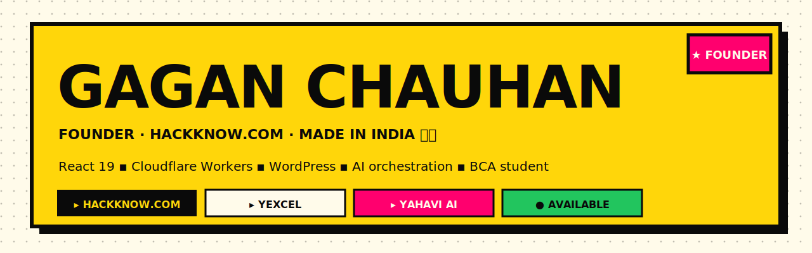
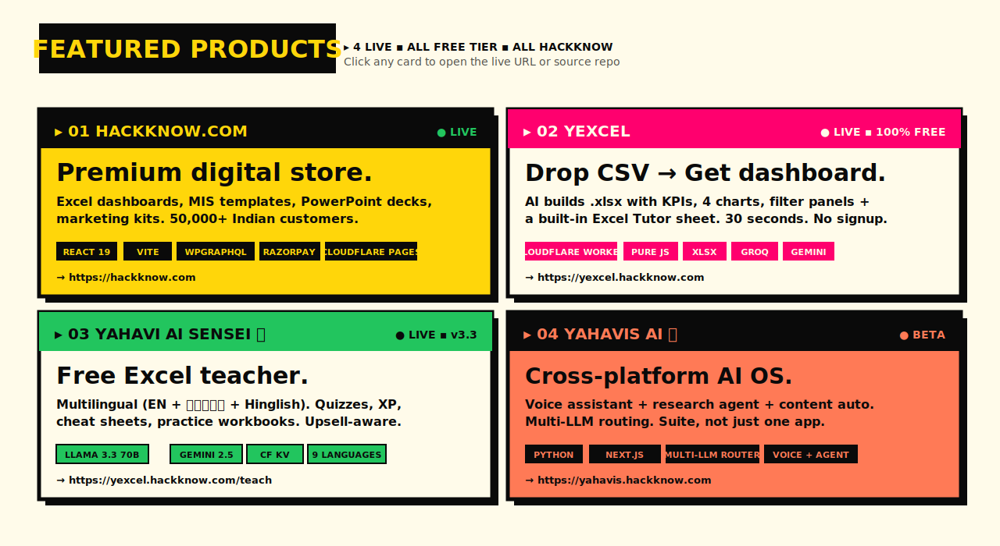
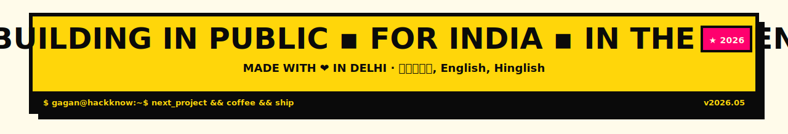

<!-- ────────────────────────────────────────────────────────────────── -->
<!--  Gagan Chauhan — Profile README (NEOBRUTALISM EDITION)             -->
<!--  Theme: hackknow.com — hack-yellow #FFD60A, hack-black #0A0A0A,     -->
<!--         hack-magenta #FF006E, hack-orange #FF7A56, hack-green       -->
<!--         All cards use hard 6px offset shadows + thick black borders -->
<!-- ────────────────────────────────────────────────────────────────── -->

<a href="https://hackknow.com">
  
</a>

<p align="center">
  <a href="https://komarev.com/ghpvc/?username=gaganchauhan1997">
    
  </a>
  <a href="https://github.com/gaganchauhan1997?tab=followers">
    
  </a>
  <a href="https://hackknow.com">
    
  </a>
  <a href="https://yexcel.hackknow.com">
    
  </a>
</p>


## ▓ ABOUT ME

```yaml
name:        Gagan Chauhan
based_in:    Delhi, India  🇮🇳
website:     https://hackknow.com
languages:   English · हिंदी · Hinglish
education:   BCA student
work:        Founder · Hackknow.com (India's premium digital marketplace)
skills:      React · TypeScript · Cloudflare Workers · WordPress
             WPGraphQL · Razorpay · prompt engineering · monorepos
             AI multi-orchestration (Groq + Gemini + Llama + Claude)
mission:     make every Indian professional 10× faster in Excel
fun_fact:    Built a CSV → working Excel dashboard generator that
             runs entirely on a single Cloudflare Worker (no deps,
             no signup, no paywall). Try it: yexcel.hackknow.com
```


<a href="https://hackknow.com">
  
</a>


## ▓ TECH STACK

<table>
<tr>
<td valign="top" width="33%">

### ▸ FRONTEND
<p>
  
  
  
  
  
  
</p>

</td>
<td valign="top" width="33%">

### ▸ BACKEND + INFRA
<p>
  
  
  
  
  
  
  
</p>

</td>
<td valign="top" width="33%">

### ▸ AI + COMMERCE
<p>
  
  
  
  
  
  
  
</p>

</td>
</tr>
</table>


## ▓ GITHUB STATS

<div align="center">

<a href="https://github.com/gaganchauhan1997">
  
</a>
<a href="https://github.com/gaganchauhan1997">
  
</a>

<br/>
<br/>

<a href="https://github.com/gaganchauhan1997">
  
</a>

</div>


## ▓ TROPHIES & ACTIVITY

<div align="center">
  <a href="https://github.com/ryo-ma/github-profile-trophy">
    
  </a>
</div>

<div align="center">
  
</div>


## ▓ CURRENTLY WORKING ON

<table>
<tr>
<td width="50%" valign="top">

#### 🛍️ **HACKKNOW.COM** — scaling
Growing the catalog from 396 → 1,000 products. Auto-blog pipeline drops 60 SEO posts/day across 24 categories.

</td>
<td width="50%" valign="top">

#### 🌊 **YAHAVI AI** — multilingual upgrade
v3.3 already speaks EN+HI+Hinglish. Next: Tamil, Marathi, Bengali. Plus product-aware upsell.

</td>
</tr>
<tr>
<td width="50%" valign="top">

#### 📝 **AUTO-BLOG PIPELINE** — 10× Groq keys
GitHub Actions cron writes blogs every 4h. 80 starter keywords, anti-AI-tell prompt, rate-limit cooldown built in.

</td>
<td width="50%" valign="top">

#### 🎙️ **YAHAVI-BEYOND** — voice AI
Jarvis-style assistant for Mac + Android. Wake-word + intent routing + 7 connected skills.

</td>
</tr>
</table>


## ▓ LET'S CONNECT

<p align="center">
  <a href="https://hackknow.com">
    
  </a>
  <a href="https://linkedin.com/in/gaganchauhan1997">
    
  </a>
  <a href="https://twitter.com/hackknow">
    
  </a>
  <a href="https://yexcel.hackknow.com/teach">
    
  </a>
  <a href="mailto:hello@hackknow.com">
    
  </a>
</p>

<a href="https://hackknow.com">
  
</a>

<!--
═══════════════════════════════════════════════════════════════════
  Brutally honest, brutally yellow. ─ hackknow.com ─ 2026 ━ ✨
═══════════════════════════════════════════════════════════════════
-->
