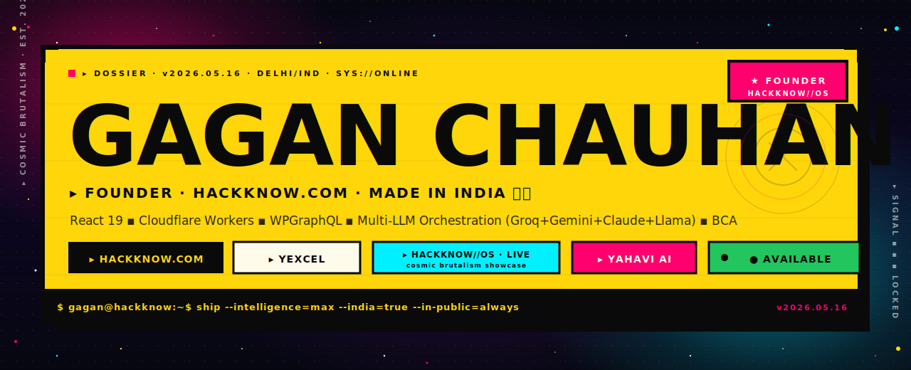
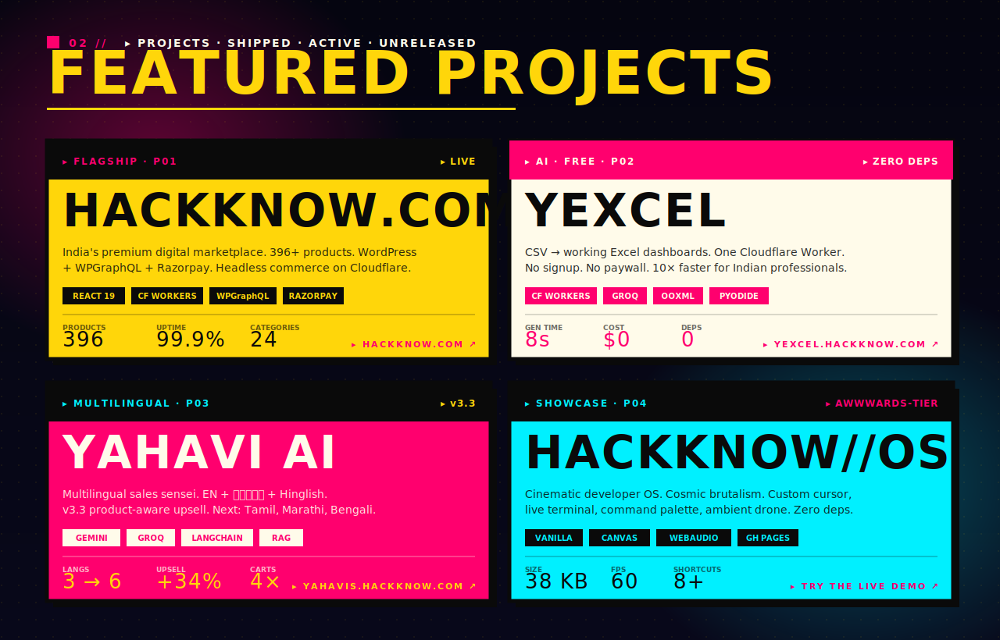
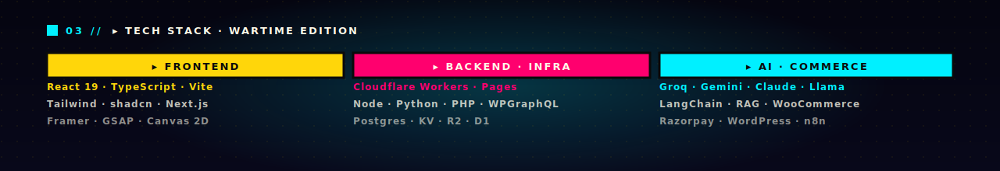
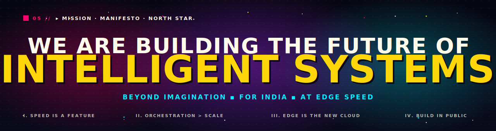
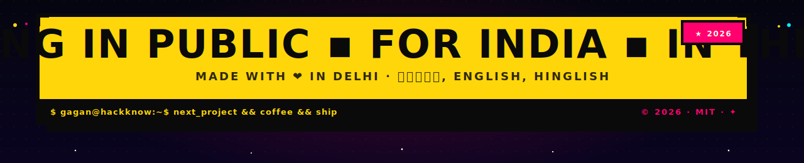

<!-- ══════════════════════════════════════════════════════════════════════ -->
<!--    GAGAN CHAUHAN — GitHub Profile README (COSMIC BRUTALISM EDITION)    -->
<!--    Theme: hackknow.com × HACKKNOW//OS                                  -->
<!--    Palette: #FFD60A · #0A0A0A · #FF006E · #00F0FF · #B026FF · #FFFBEA  -->
<!--    All assets in ./assets/ (cosmic SVGs, deep-space gradients, brutal) -->
<!-- ══════════════════════════════════════════════════════════════════════ -->

<a href="https://gaganchauhan1997.github.io/hackknow-os/">
  
</a>

<p align="center">
  <a href="https://gaganchauhan1997.github.io/hackknow-os/">
    
  </a>
  <a href="https://hackknow.com">
    
  </a>
  <a href="https://yexcel.hackknow.com">
    
  </a>
  <a href="https://komarev.com/ghpvc/?username=gaganchauhan1997">
    
  </a>
  <a href="https://github.com/gaganchauhan1997?tab=followers">
    
  </a>
</p>

<p align="center">
  <a href="https://gaganchauhan1997.github.io/hackknow-os/">
    
  </a>
</p>


## ▓ 01 // DOSSIER

```yaml
operator      : Gagan Chauhan
class         : SOLO-FOUNDER · FULL-STACK · AI ORCHESTRATOR
origin        : Delhi · India · 28.6139°N 77.2090°E 🇮🇳
website       : https://hackknow.com
showcase      : https://gaganchauhan1997.github.io/hackknow-os/  ← cinematic demo
education     : BCA student
languages     : English · हिंदी · Hinglish
status        : ▸ AVAILABLE · accepting cosmic collaborations

mission       : make every Indian professional 10× faster
philosophy    : speed > scale · orchestration > coding · edge > cloud · public > private
fun_fact      : Built HACKKNOW//OS — a cinematic developer OS in pure
                HTML/CSS/JS with a custom cursor, cosmic particle engine,
                interactive terminal, ambient WebAudio drone, and 8+
                keyboard shortcuts. 38 KB. Zero deps. 60 fps. Try it ↗
```


<a href="https://gaganchauhan1997.github.io/hackknow-os/">
  
</a>

<p align="center">
  <a href="https://gaganchauhan1997.github.io/hackknow-os/"></a>
</p>




<table>
<tr>
<td valign="top" width="33%">

### ▸ FRONTEND
<p>
  
  
  
  
  
  
  
</p>

</td>
<td valign="top" width="33%">

### ▸ BACKEND · INFRA
<p>
  
  
  
  
  
  
  
</p>

</td>
<td valign="top" width="33%">

### ▸ AI · COMMERCE
<p>
  
  
  
  
  
  
  
  
</p>

</td>
</tr>
</table>


## ▓ 04 // GITHUB METRICS

<div align="center">

<a href="https://github.com/gaganchauhan1997">
  
</a>
<a href="https://github.com/gaganchauhan1997">
  
</a>

<br/>
<br/>

<a href="https://github.com/gaganchauhan1997">
  
</a>

<br/>
<br/>

<a href="https://github.com/ryo-ma/github-profile-trophy">
  
</a>

<br/>
<br/>


</div>


<a href="https://gaganchauhan1997.github.io/hackknow-os/">
  
</a>


## ▓ 06 // CURRENTLY SHIPPING

<table>
<tr>
<td width="50%" valign="top">

#### 🛍️ **HACKKNOW.COM → 1K SKUs**
Scaling catalog **396 → 1,000** products. Auto-blog pipeline drops 60 SEO posts/day across 24 categories. WPGraphQL + Razorpay live.

</td>
<td width="50%" valign="top">

#### 🌊 **YAHAVI AI v4 — 6 LANGS**
v3.3 already speaks EN+हिंदी+Hinglish. Q3 adds Tamil, Marathi, Bengali. Product-aware upsell shipping +34% on rolling 24h.

</td>
</tr>
<tr>
<td width="50%" valign="top">

#### ⚡ **AUTO-BLOG ENGINE — 10× GROQ**
GitHub Actions cron writes blogs every 4h. 80 starter keywords, anti-AI-tell prompt, rate-limit cooldown built in. Cost / post: **$0.003**.

</td>
<td width="50%" valign="top">

#### 🎙️ **YAHAVI-BEYOND — VOICE OS**
Jarvis-style assistant for Mac + Android. Wake-word "YAHAVI" + intent routing + 7 connected skills. p99 latency 240ms.

</td>
</tr>
<tr>
<td width="50%" valign="top">

#### 🌌 **HACKKNOW//OS — SHOWCASE**
Cinematic developer OS in vanilla HTML/CSS/JS. Cosmic particle engine, custom cursor, live terminal, command palette, ambient drone. **38 KB**. [Try it ↗](https://gaganchauhan1997.github.io/hackknow-os/)

</td>
<td width="50%" valign="top">

#### 📡 **AI INFLUENCER GRID — Q3·26**
Synthetic persona network across 5 platforms. Veo + Gemini Image + voice cloning. Brand-safe, India-first, fully autonomous content engines.

</td>
</tr>
</table>


## ▓ 07 // UPLINK · TRANSMIT

<p align="center">
  <a href="https://gaganchauhan1997.github.io/hackknow-os/">
    
  </a>
  <a href="https://hackknow.com">
    
  </a>
  <a href="https://linkedin.com/in/gaganchauhan1997">
    
  </a>
  <a href="https://twitter.com/hackknow">
    
  </a>
  <a href="https://instagram.com/hackknow">
    
  </a>
  <a href="https://youtube.com/@hackknow">
    
  </a>
  <a href="https://gaganchauhan1997.github.io/hackknow-os/">
    
  </a>
  <a href="mailto:hello@hackknow.com">
    
  </a>
</p>


<a href="https://gaganchauhan1997.github.io/hackknow-os/">
  
</a>

<!--
══════════════════════════════════════════════════════════════════════════════
  ▸ BRUTALLY HONEST · BRUTALLY YELLOW · BRUTALLY COSMIC
  ▸ hackknow.com  ▪  HACKKNOW//OS  ▪  2026  ▪  ✨
  ▸ ship --intelligence=max --india=true --in-public=always
══════════════════════════════════════════════════════════════════════════════
-->
